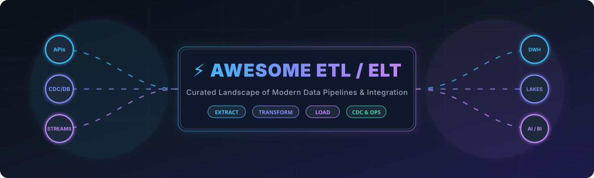

# Awesome-ETL ⚡

 

  

## 🚀 Top ETL & ELT Platforms Ecosystem
**Curated Guide to SaaS Products & Open-Source GitHub Projects**  
*Focused on Data Integration, ELT/ETL Pipelines, Connectors, CDC, Orchestration & Cloud Warehouse Loading*  
📅 **Last updated: August 2026**

---

This repository tracks notable **SaaS platforms** and **open-source projects** for modern **ETL / ELT**, reverse ETL, stream processing, change data capture (CDC), and data orchestration. These tools extract data from sources (SaaS apps, transactional databases, event streams, files), transform it, and load it into data warehouses, lakes, or destination storage engines — equipped with reliable connectors, automated schema evolution, scheduling, and monitoring.

💡 **Open-source emphasis**: This section is heavily expanded with top open-source projects for self-hosting, custom connectors, DataOps workflows, and full control over data movement — ideal for data engineers, analytics teams, and organizations seeking transparent, cost-effective, vendor-lock-in-free pipelines.

---

## 📑 Table of Contents
- [☁️ SaaS / Hosted Platforms](#️-saas--hosted-platforms)
- [⭐ Open-Source GitHub Projects](#-open-source-github-projects)
- [🧩 Additional Strong Open-Source Options](#-additional-strong-open-source-options)
- [🏗️ Recommended Architecture Stacks](#️-recommended-architecture-stacks)
- [📈 Star History](#-star-history)
- [🤝 How to Contribute](#-how-to-contribute)
- [⚠️ Disclaimer](#️-disclaimer)

---

## ☁️ SaaS / Hosted Platforms

*Sorted in descending order by parent company market valuation / annual revenue scale.*

| Platform | Company Scale (Valuation / Revenue) | Description | Starting Tier / Pricing | Free Tier / Free Trial Limits |
| :--- | :--- | :--- | :--- | :--- |
| **[Azure Data Factory](https://azure.microsoft.com/en-us/products/data-factory/)** | **~$3.0+ Trillion Market Cap** (Microsoft) | Microsoft’s managed hybrid data integration service featuring code-free data flows, SSIS lift-and-shift, and native Azure fabric integration. | **Consumption Rates:** Data movement starts at $0.25/DIU-hour; pipeline orchestration at $1.00 per 1,000 runs; Data Flows at $0.268/vCore-hour | **30-day Azure Free Trial** ($200 credit across Azure services; no perpetual free tier for pipeline activities) |
| **[AWS Glue](https://aws.amazon.com/glue/)** | **~$100+ Billion Cloud Revenue** (Amazon / AWS) | Serverless Spark & Python ETL/ELT service with automated schema discovery, Data Catalog metadata repository, and serverless job orchestration. | **Pay-As-You-Go:** $0.44 per DPU-Hour for standard execution ($0.29 per DPU-Hour for Flex execution; billed per second with 1-min minimum) | **Free Forever Tier (Data Catalog):** First 1,000,000 objects stored and first 1,000,000 requests/month free |
| **[IBM DataStage](https://www.ibm.com/products/datastage)** (IBM Cloud) | **~$200+ Billion Market Cap** (IBM) | High-performance parallel multi-node ETL engine designed for complex, massive-scale batch and hybrid enterprise workloads. | **Pay-As-You-Go:** Starts at ~$1.75 per Capacity Unit-Hour (CUH); Enterprise small bundle starts at 5,000 CUH/month | **Lite Plan (Free Forever):** 15 Capacity Unit-Hours (CUH) per month, max 1 concurrent job run |
| **[Informatica](https://www.informatica.com/)** (IDMC) | **~$10+ Billion Valuation** / ~$1.6B+ Revenue | Enterprise-grade Intelligent Data Management Cloud (IDMC) with 50,000+ connectors, master data management (MDM), and AI-driven automation (CLAIRE). | **Consumption / IPU Model:** Starting tiers estimated at ~$1.50–$3.00 per IPU (annual contracts typically starting at $15,000–$50,000+) | **30-day free trial** (Access to Cloud Data Integration and IDMC core services) |
| **[Fivetran](https://www.fivetran.com/)** | **~$5.6 Billion Valuation** | Fully managed automated ELT leader known for automated schema drift management, high-volume database CDC, and enterprise security. | **Standard Plan:** Usage-based starting at ~$1.00 per connection/month base + metered MAR (Monthly Active Rows) rates | **Free Forever Tier:** Up to 500,000 MAR/month, 3,500 activation MAR, and 5,000 monthly transformation model runs (plus 14-day unlimited trial) |
| **[Talend](https://www.talend.com/)** (Qlik Talend) | **~$2.4 Billion Acquisition / Private** (Thoma Bravo / Qlik) | Enterprise data integration platform with deep ETL transformations, data quality profiling, and hybrid multi-cloud deployment. | **Starter Tier:** Custom capacity-based billing (benchmarked around ~$1,000–$1,170/month; enterprise quotes via sales) | **14-day free trial** (Full platform trial; legacy Open Studio retired) |
| **[Matillion](https://www.matillion.com/)** | **~$1.5 Billion Valuation** | Cloud-native ELT platform built specifically for Snowflake, Databricks, BigQuery, and Redshift using pushdown warehouse compute. | **Developer Tier:** Pay-as-you-go credit model starting at ~$2.00–$2.70 per credit (includes 1 developer user; task-hour consumption) | **14-day free trial** (Includes 500 complimentary platform credits) |
| **[Airbyte Cloud](https://airbyte.com/)** | **~$1.5 Billion Valuation** | Managed cloud edition of the popular open-source ELT framework, providing hosted workers, API syncs, and connector catalog management. | **Standard Cloud:** Starts at $10/month (includes 4 credits; additional usage at $2.50 per credit) | **14-day free trial** with full cloud features (Open Source Core is perpetually free for self-hosting) |
| **[Hevo Data](https://hevodata.com/)** | **~$200+ Million Valuation** | No-code / low-code near-real-time ELT pipeline platform with zero maintenance, fault-tolerant replication, and embedded data transformations. | **Starter Plan:** Starts at $299/month ($265/month billed annually) for up to 5 million events/month | **Free Forever Tier:** Up to 1,000,000 events/month on unlimited free sources and models (plus 14-day unrestricted trial) |
| **[Stitch](https://www.stitchdata.com/)** | **~$60 Million Acquisition** (Talend / Qlik) | Lightweight, self-service managed data replication service built on the Singer framework for rapid SaaS-to-warehouse ingestion. | **Standard Plan:** Starts at $100/month for up to 5 million replicated rows/month (scaling to $1,250/month for Advanced) | **14-day free trial** (Unlimited replicated rows during trial + 7-day historical sync grace period per new integration) |

---

## ⭐ Open-Source GitHub Projects

*Sorted in descending order by GitHub star count.*

- **[Apache Spark](https://github.com/apache/spark)**   
  ⚡ Foundational unified analytics and large-scale parallel data processing engine for batch ETL, streaming pipelines, SQL queries, and machine learning workloads.
- **[Apache Airflow](https://github.com/apache/airflow)**   
  🌪️ The industry-standard programmatic workflow orchestrator. Author, schedule, and monitor complex Directed Acyclic Graph (DAG) ETL/ELT pipelines using native Python.
- **[Apache Kafka](https://github.com/apache/kafka)**   
  📡 Distributed event streaming platform and real-time data bus powering mission-critical streaming ETL and high-throughput publish-subscribe message queues.
- **[Prefect](https://github.com/prefecthq/prefect)**   
  🪄 Modern Python workflow orchestration and coordination platform designed for resilient, dynamic data pipelines with native async support and instant observability.
- **[Airbyte](https://github.com/airbytehq/airbyte)**   
  🔄 The leading open-source ELT data integration engine with 300+ pre-built connectors, a flexible Connector Development Kit (CDK), web UI, and Docker/Kubernetes deployment.
- **[Kestra](https://github.com/kestra-io/kestra)**   
  🎛️ Declarative, event-driven orchestrator for data pipelines and microservices configured via YAML with real-time UI, high scalability, and 500+ plugin integrations.
- **[Dagster](https://github.com/dagster-io/dagster)**   
  🧱 Cloud-native, asset-based data orchestrator that models data dependencies, assets, and lineage with built-in local development and testing tools.
- **[Mage](https://github.com/mage-ai/mage-ai)**   
  🧙 Modern data pipeline tool for transforming and integrating data with interactive notebook-style pipeline construction, SQL/Python blocks, and built-in observability.
- **[dbt Core](https://github.com/dbt-labs/dbt-core)**   
  🛠️ The standard open-source transformation framework (the "T" in ELT). Write modular SQL/Python models, automated testing, documentation, and data versioning inside modern warehouses.
- **[Debezium](https://github.com/debezium/debezium)**   
  🔍 Distributed change data capture (CDC) platform built on Apache Kafka Connect for real-time row-level transaction log capture from PostgreSQL, MySQL, SQL Server, and MongoDB.
- **[dlt (data load tool)](https://github.com/dlt-hub/dlt)**   
  🐍 Lightweight, developer-friendly Python library for turning messy data sources into structured, clean datasets with automated schema inference and maintenance.
- **[Apache NiFi](https://github.com/apache/nifi)**   
  🔀 Visual dataflow automation and routing platform supporting complex event-driven data ingestion, backpressure management, protocol mediation, and provenance tracking.
- **[Apache Flink](https://github.com/apache/flink)**   
  🌊 High-throughput, stateful stream processing framework providing low-latency distributed stream & batch data transformations and complex event processing.
- **[Apache SeaTunnel](https://github.com/apache/seatunnel)**   
  🚄 Next-generation ultra-high-performance distributed data integration engine capable of synchronizing massive volumes of data daily across hundreds of sources.
- **[Meltano](https://github.com/meltano/meltano)**   
  📦 Declarative, GitOps-friendly data integration CLI built on Singer taps and targets, enabling code-first ELT pipelines with version control and environment isolation.
- **[Singer](https://github.com/singer-io)**   
  🔌 Open-source JSON-stream specification and ecosystem of composable taps (extractors) and targets (loaders) for building modular data movement pipelines.
- **[Sling](https://github.com/slingdata-io/sling-cli)**   
  🎯 Modern, high-speed CLI and library for streaming data between databases, cloud storage buckets, and data warehouses with zero external dependencies.
- **[Ingestr](https://github.com/bruin-data/ingestr)**   
  ⚡ CLI tool that copies data from any source database or API to any destination with a single command, schema copy, and built-in type mapping.

---

## 🧩 Additional Strong Open-Source Options
- **Workflow & Orchestration**: Argo Workflows, Temporal, Cadence.
- **Data Quality & Testing**: Great Expectations, Soda Core, Elementary Data, DeeQU.
- **Embedded & In-Process Engines**: DuckDB, Polars, Apache Arrow, DataFusion.
- **Metadata, Catalog & Governance**: OpenMetadata, DataHub, Amundsen, Apache Atlas.
- **Reverse ETL & Activation**: Multiwoven, Grouparoo.

---

## 🏗️ Recommended Architecture Stacks
Pair open-source modular components for full control, zero vendor lock-in, and elastic scaling:
1. **Extraction & Ingestion (Extract & Load)**: Airbyte, Meltano, dlt, Sling, or Ingestr.
2. **Transformation (In-Warehouse Transformations)**: dbt Core, SQLMesh, DuckDB, or Apache Spark.
3. **Change Data Capture (CDC & Streaming)**: Debezium, Apache Kafka, Apache Flink.
4. **Pipeline Orchestration (Scheduling & Monitoring)**: Apache Airflow, Prefect, Dagster, or Kestra.
5. **Data Quality & Observability**: Great Expectations, Elementary Data, Soda.

---

## 📈 Star History

---

## 🤝 How to Contribute
1. Fork this repository.
2. Add or update entries in `README.md` following the established structure and markdown table conventions.
3. Include: Tool Name, official website or repository link, company valuation or GitHub star count badge, and a concise 1–2 sentence description.
4. Submit a Pull Request with a descriptive summary.

⭐ Star the repo if you find this list helpful!

---

## ⚠️ Disclaimer
- This is a **community-curated** landscape — not exhaustive and not an official vendor endorsement.
- Data integration pipelines often move sensitive or regulated customer data; ensure compliance with GDPR, HIPAA, SOC2, and data residency guidelines.
- Self-hosted open-source pipelines require operational governance (monitoring, patch management, access security, and compute provisioning).

---
**Made with ❤️ for data engineers, analytics engineers, and data platform builders.**  
*Let's build faster, more open, reliable, and controllable data pipelines together.*